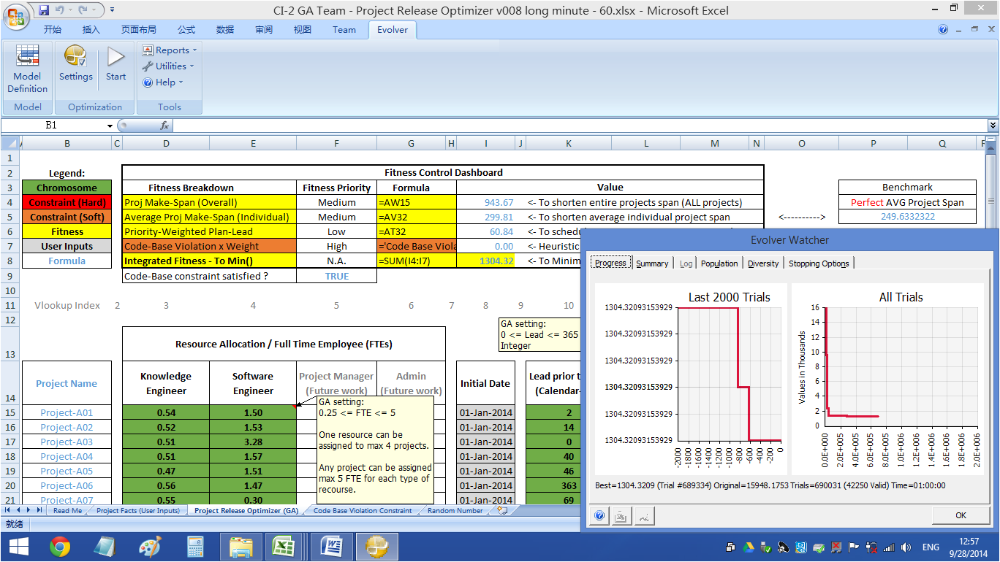
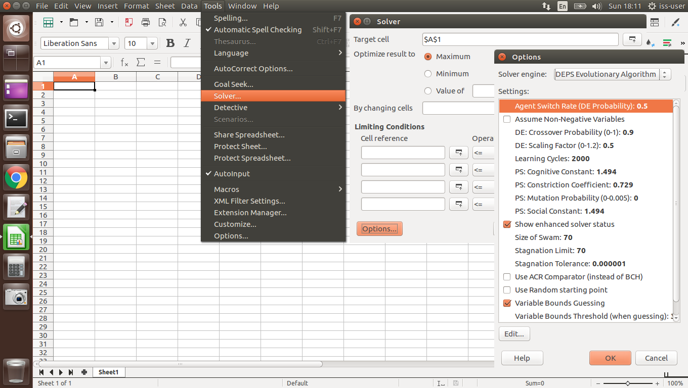

### Worksop Project Submission Template: Github Repository & Zip File

**[Naming Convention]** CourseCode-StartDate-BatchCode-Group_or_Individual-TeamName_or_PersonName-ProjectName.zip

* **[MTech Group Project Naming Example]** IRS-MR-2019-01-19-IS1PT-GRP-AwsomeSG-HDB_BTO_Recommender.zip

* **[MTech Individual Project Naming Example]** IRS-MR-2019-07-01-IS1FT-IND-SamGuZhan-HDB_BTO_Process.zip

* **[EEP Group Project Naming Example]** IRS-MR-2019-03-13-EEP-GRP-AwsomeSG-HDB_BTO_Recommender.zip

* **[EEP Individual Project Naming Example]** IRS-MR-2019-08-22-EEP-IND-SamGuZhan-HDB_BTO_Process.zip

[Online editor for this README.md markdown file](https://pandao.github.io/editor.md/en.html "pandao")

---

### <<<<<<<<<<<<<<<<<<<< Start of Template >>>>>>>>>>>>>>>>>>>>

---

## SECTION 1 : PROJECT TITLE
## GA Optimizer for Project Release Scheduling and Resource Allocation

---
## SECTION 2 : EXECUTIVE SUMMARY / PAPER ABSTRACT

**Abstract**

We developed an IT project release schedule optimizer using Genetic Algorithm, considering various real world constraints, including human resources, lead time and software version compatibility. The goal for optimizer is to shorten the overall projects' life span as well as individual project's life spans for a group of concurrently running projects. The implementation tools used are Microsoft Excel and Evolver.

**Keywords**: Genetic Algorithm, Project Release Management, Optimization, Evolver

**Problem Introduction**

Release Management is the process of managing software (IT project) releases from development stage to software release in production. Software products (with different versions/upgrades) are typically in an ongoing cycle of planning, development, various testing, and production release.

There is growing complexity of dynamic project dependencies, maximum available resources, and large number of parallel running projects, together with various moving/changing influencing factors to take into consideration. These factors must fit together seamlessly to guarantee success and long-term value of multiple running projects as a whole.

We developed a simplified GA optimizer to conduct multiple project releases scheduling (to shorten make-span of both individual project and all projects as a whole), considering several resource constraints, including available human resources, testing environments, and software version conflicts among all projects.

---
## SECTION 3 : CREDITS / PROJECT CONTRIBUTION

| Official Full Name  | Student ID (MTech Applicable)  | Work Items (Who Did What) | Email (Optional) |
| :------------ |:---------------:| :-----| :-----|
| GU Zhan (Sam) | A0107682A | domain modeling, system design, fitness function design, score integraion | dummy@dummy.com |
| LIU Jie (Judy) | A0107579U | execuate GA runs, draft report | dummy@dummy.com |
| Francisco Liwa | A0107538A | execuate GA runs, version control | dummy@dummy.com |

---
## SECTION 4 : VIDEO OF SYSTEM MODELLING & USE CASE DEMO

Note: It is not mandatory for every project member to appear in video presentation; Presentation by one project member is acceptable. 
More reference video presentations [here](https://telescopeuser.wordpress.com/2018/03/31/master-of-technology-solution-know-how-video-index-2/ "video presentations")

---
## SECTION 5 : USER GUIDE

**iss-vm** virtual machine contains an evolutionary nonlinear programming solver, as a plug-in for LibreOffice Calc (Microsoft Excel alike). 

The NLP Solver contains below two algorthms/models:

https://wiki.openoffice.org/wiki/NLPSolver

**1. DEPS - Differential Evolution & Particle Swarm Optimization**

DEPS consists of two independent algorithms: Differential Evolution and Particle Swarm Optimization. Both are especially suited for numerical problems, such as nonlinear optimization, and are complementary to each other in that they even out their others shortcomings.

The idea behind Particle Swarm Optimization is to represent every solution vector as coordinates in an n-dimensional room. Each individual (particle) traverses through that space and keeps track of its own best point so far. This information as well as the knowledge about the particle with the best current solution influence how it will move in each iteration. Due to that, the particles will always try to build a swarm and float around the best solutions, traversing possible even better solutions on its way.

Differential Evolution on the other hand is a strategy to "recombine" two individuals similar to Genetic Algorithms. Instead of crossing over chromosomes (i.e. mixing up their variables), the knowledge about the target function is used to anneal both points.

In each iteration of the algorithm, each individual chooses one of both strategies and applies them to its current solution vector. The probability, which strategy is chosen, can be modified with the option Agent Switch Rate.

**2. SCO - Social Cognitive Optimization**

SCO takes into account the human behavior of learning and sharing informations. Each individual has access to a common library with knowledge shared between all individuals.

In each step, an individual looks up the (presumably) best information available in the library and builds a decision based on it together with its own current knowledge about the problem. Afterwards it replaces one of the worse informations from the library with its newly learned solution.

That way all individuals work together (the social aspect) and make up their own mind (the cognitive aspect). Therefore it's called Social Cognitive Optimization.

`<Github File Link>` : <https://github.com/telescopeuser/Workshop-Project-Submission-Template-GA-Optimizer/blob/master/UserGuide/Refer%20to%20Project%20Release%20Optimizer.xlsx.txt>

---
## SECTION 6 : PROJECT REPORT / PAPER

`<Github File Link>` : <https://github.com/telescopeuser/Workshop-Project-Submission-Template-GA-Optimizer/blob/master/ProjectReport/GA%20Optimizer%20Report.pdf>

**Recommended Sections for Project Report / Paper:**
- Executive Summary / Paper Abstract
- Sponsor Company Introduction (if applicable)
- Business Problem Background
- Project Objectives & Success Measurements
- Project Solution (To detail domain modelling & system design.)
- Project Implementation (To detail system development & testing approach.)
- Project Performance & Validation (To prove project objectives are met.)
- Project Conclusions: Findings & Recommendation
- List of Abbreviations (if applicable)
- References (if applicable)

---
## SECTION 7 : MISCELLANEOUS

### Visual Dashboard.xlsx
* Visual summary of below Evaluation Statistics

### Evaluation Statistics
* Raw evaluation results for respective project release optimization GA runs, shown below:

We evaluate the GA model in two main approaches, with same initial fitness (project data inputs) for all GA runs:
1. Conduct **Fixed**, **Mutation-Adaptive** and **Crossover-Adaptive** GA runs for ten rounds respectively, at 5 minutes per GA run. Thus in total there are **30 GA runs**, covering 150 minutes or 2.5 hours running time.

2. Conduct one round of GA run with respective longer time limits: **10, 20, 30, 40, 50, 60 minutes, and 2, 4, 6, 8 hours**. Thus in total there are **10 GA runs**, covering 1,360 minutes or 22.67 hours running time.

---

### <<<<<<<<<<<<<<<<<<<< End of Template >>>>>>>>>>>>>>>>>>>>

---

**This [NICF - Reasoning Systems (SF)](https://www.iss.nus.edu.sg/executive-education/course/detail/reasoning-systems/analytics-and-intelligent-systems "Reasoning Systems") course is part of the Analytics and Intelligent Systems and Graduate Certificate in [Intelligent Reasoning Systems (IRS)](https://www.iss.nus.edu.sg/stackable-certificate-programmes/intelligent-systems "Intelligent Reasoning Systems") series offered by [NUS-ISS](https://www.iss.nus.edu.sg "Institute of Systems Science, National University of Singapore").**

**Course Manager: [GU Zhan (Sam)](https://www.iss.nus.edu.sg/about-us/staff/detail/201/GU%20Zhan "GU Zhan (Sam)")**

**zhan.gu@nus.edu.sg**
